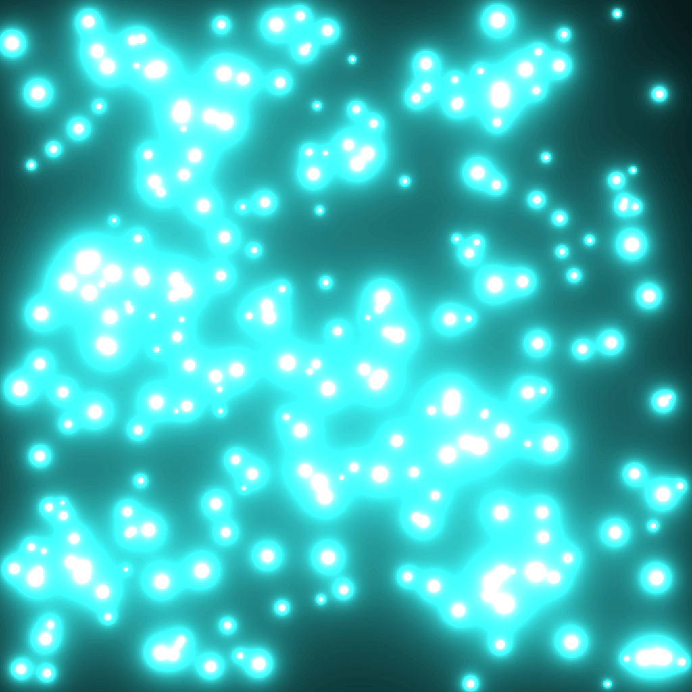
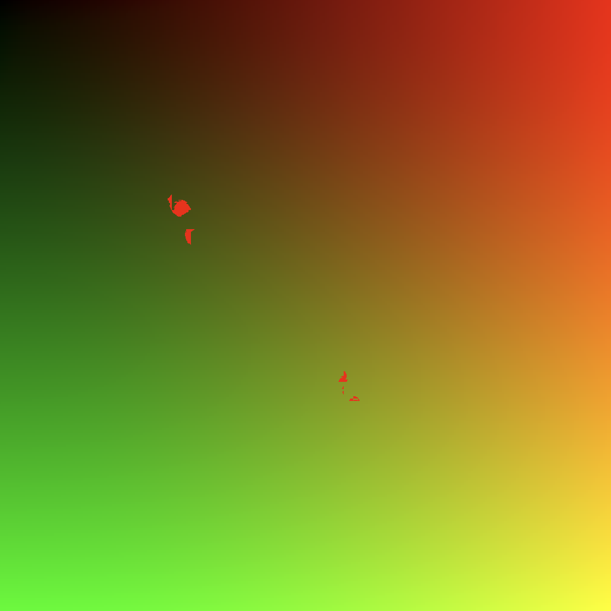

**Note**: webgpu was still in experimental phases when I wrote all this code. iirc, at the time i was trying to develop on both a canary version of google chrome, and a nightly version of firefox.

everything still seems to work on `chrome canary 133.0.6921.0`
only `hello-compute` works on `firefox nightly 124.0a1`

whatever the issues are can probably be fixed with some simple updates to match the latest spec or api requirements.

## hello-compute

get an understanding of compute shaders (data upload, the shader program, data retrieval)

## hello-triangle

the real "hello world" of 3d - render a triangle

## marching-squares

metaballs in 2d with marching squares, probably a port from the same implementation i did in webgl

## mutate-buffer-mid-draw

an experiment where the api seems to let you change data in a buffer as its rendering, which can cause non-deterministic renders, but doesn't seem to cause any other errors

# Resources

docs: https://developer.mozilla.org/en-US/docs/Web/API/GPUDevice

working group: https://github.com/gpuweb

a taste of webgpu in firefox: https://hacks.mozilla.org/2020/04/experimental-webgpu-in-firefox/
(good comparisons between webgpu/webgl)